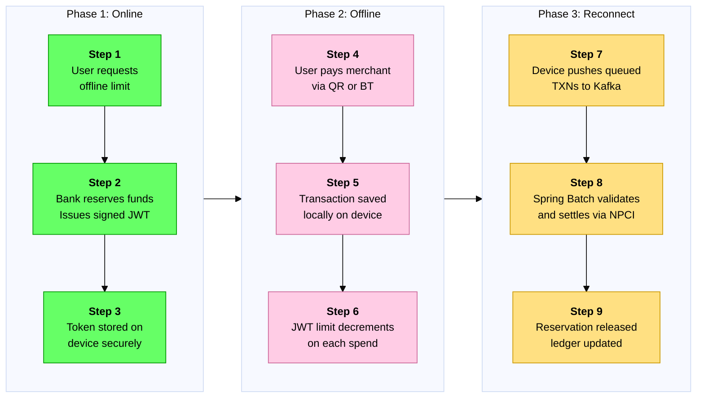

# Paron

## Overview
Paron is a distributed offline payment settlement system aligned with RBI'S digital ruppee intiative. Its been designed to handle fund reservation,JWT-based offline token spending,Idempotent kafka driven settlement and fraud detection 

## Architecture


## Project Structure

```text
offline-payment-system/
├── token-service/               # Issues and validates JWT spending tokens
│   ├── src/main/java/
│   │   ├── controller/          # REST API endpoints
│   │   ├── service/             # Business logic
│   │   ├── model/               # Token data models
│   │   └── security/            # JWT signing and verification
│   └── pom.xml
├── ledger-service/              # Talks to bank, reserves/releases funds
│   ├── src/main/java/
│   │   ├── controller/
│   │   ├── service/
│   │   ├── repository/          # JPA repos for PostgreSQL
│   │   └── model/
│   └── pom.xml
├── sync-service/                # Receives offline TXNs when device reconnects
│   ├── src/main/java/
│   │   ├── kafka/               # Kafka consumers and producers
│   │   ├── batch/               # Spring Batch settlement jobs
│   │   ├── idempotency/         # Prevents duplicate processing
│   │   └── service/
│   └── pom.xml
├── fraud-service/               # Scores each transaction for risk
│   ├── src/main/java/
│   │   ├── rules/               # Rule-based checks
│   │   ├── ml/                  # Simple ML scoring (optional)
│   │   └── service/
│   └── pom.xml
├── api-gateway/                 # Single entry point, routes all requests
│   └── src/main/java/
├── docker-compose.yml           # Runs everything locally together
├── README.md                    # Your portfolio showcase document
└── docs/
    ├── architecture.md
    └── api-spec.yaml            # OpenAPI/Swagger docs
```

