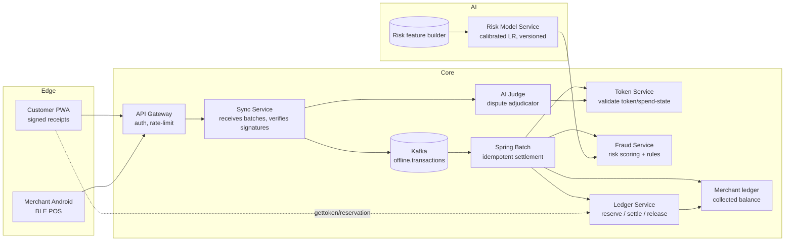

# Paron — Offline Payments with an AI Risk Manager

**One-line pitch:** Paron lets a customer spend money *while their phone is offline* (airplane mode) using a **reservation-backed JWT**, settles every receipt when the device reconnects, and protects merchants by screening each synchronized transaction with a **defence-only AI risk manager** that only ever says APPROVE / HOLD / REJECT.

Built for the **Razorpay AI Buildathon — Track 2 (AI Risk Manager)**. Everything is reproducible with `docker compose up` + a local stack, and the AI layer ships its own **measured precision/recall report** and a **deterministic fraud drill**.

---

## The problem

When a customer pays but their phone is offline, the merchant accepts the risk of *delayed settlement*: the same token can be replayed, a receipt can be forged, a device can be compromised, or amounts can be doctored after signing. Paron's answer is two-sided:

1. **Bounded exposure by construction** — the money is *reserved* before the customer goes offline, and a capped JWT token is what moves between devices. There is no new money created at the POS.
2. **AI risk-managed settlement** — every receipt that comes back online is re-validated, signature-checked, scored by a calibrated risk model, and routed through a deterministic three-state decision gate before a single rupee moves.

---

## How it works (the demo)

```
PHASE 1 (online)     PHASE 2 (offline, airplane mode + Bluetooth)   PHASE 3 (reconnect)
─────────────────    ─────────────────────────────────────────────  ───────────────────────────
customer requests    customer pays merchant:                        device pushes queued
an offline limit     every payment is SIGNED on-device              receipts to sync-service
                     with an ECDSA P-256 key, appended to a
bank RESERVES the    local queue with deviceId + public key         each receipt is
funds and issues                                                  o  signature re-verified
a capped JWT token   POS refuses above the displayed limit          o  token spend-state checked
                                                                   o  fraud score computed
token stored on                                                    o  rule stack applied
the device                                                    ────►  APPROVE  → settle once
                                                                     HOLD     → review, no money moves
                                                                     REJECT   → never settles
```

- Customer app: a **PWA** (offline-capable, signs every transaction).
- Merchant app: an **Android/BLE** device that shows the collected balance.
- Phones genuinely work offline (`airplane mode` + Bluetooth) and settle at the café's Wi-Fi.

---

## Architecture



**Key design rules**

- The **ledger is the only component that moves money**. Token validation, the fraud gate and transaction idempotency are independent controls layered *before* it.
- **Signed receipts** (Step 0): every transaction is signed with a device-held ECDSA P-256 key using a canonical string (`deviceTransactionId␀token␀merchant␀amount␀time␀deviceId`). Sync-service re-verifies it before the receipt is even accepted; the AI Judge can re-verify rows again at dispute time.
- **Deterministic first, AI second**: a hard rule hit (token reuse, duplicate payload, velocity breach, amount anomaly, temporal impossibility) is a **hard REJECT** — no model score can override it. The model only decides inside the band where no rule fired.
- **Low-signal never auto-approves**: a brand-new device with zero history is routed to HOLD, not silently approved (this was a real gap the drill found — see *what broke at 2AM*).
- **Failure closes closed**: model timeout, unknown model version, or any dependency error → `HOLD_FOR_REVIEW`, never `APPROVE`.

---

## Services

| Service | Port | Responsibility |
|---|---|---|
| `api-gateway` | 8080 | Single entry point; RS256 user-JWT auth, rate limiting; internal money/fraud endpoints are intentionally **not** public. |
| `token-service` | 8081 | Issues capped offline tokens against a ledger reservation; cumulative validate; one-time `mark-used`; read-only spend-state endpoint. |
| `ledger-service` | 8082 | Customer accounts, **reservation/settlement**, merchant accounts & collected balance. |
| `sync-service` | 8083 | Receives reconnection batches (max 100), verifies ECDSA signatures, idempotent Kafka→Spring Batch settlement, merchant credit, and the **AI Judge** adjudication endpoint. |
| `fraud-service` | 8084 | Rule stack + calibrated model score → APPROVE / HOLD / REJECT, with a low-signal guard and reviewable alert queue. |
| `risk-model-service` | 8600 | Versioned calibrated logistic-regression classifier; returns score, confidence, top-3 reason-code contributions. Standalone. |
| `pwa/` `merchant-android/` | — | The two phones used in the demo. |

Infrastructure: **Kafka** + **Redis** via `docker-compose.yml`; **Supabase Postgres** via env vars (`.env.example`).

---

## Repo layout

```text
├── api-gateway/            # Spring Cloud Gateway
├── token-service/          # offline tokens + spend state
├── ledger-service/         # reservations, settlement, merchant accounts
├── sync-service/           # receipt intake, signatures, batch settle, AI Judge
├── fraud-service/          # rules + model gate (3-state decision)
├── risk-model-service/     # calibrated model API (FastAPI)
├── ml/                     # synthetic generator + evaluation + fraud drill
├── pwa/                    # customer offline PWA (Netlify-ready)
├── merchant-android/       # merchant BLE POS (Android)
├── docs/                   # SRS, architecture, two-phone demo, reports
└── docker-compose.yml      # Kafka + Redis
```

---

## Run it

```bash
# 1. Infrastructure
docker compose up -d                 # Kafka :9092 + Redis :6379

# 2. Secrets (Supabase Postgres etc.)
Copy .env.example → .env  (and keep set-env.ps1 out of git)

# 3. Model service (the AI layer)
cd risk-model-service && pip install -r requirements.txt
uvicorn app.main:app --port 8600

# 4. The five Java services (or via IntelliJ)
.\mvnw.cmd -pl api-gateway,token-service,ledger-service,sync-service,fraud-service -am compile

# 5. The two phones
#    PWA:         cd pwa && npm run dev (Netlify hosts it with HTTPS)
#    Merchant:    open merchant-android/ in Android Studio → build to the Android phone

# 6. End-to-end manual test collection
See testing-guide.http  (Step 0 → 12 happy path, N1 → N7 negative paths)
```

Demo settings: ₹5,000 token cap, ₹1,000 individual payment cap, 6-hour expiry, 10% guarantee reserve — all configurable.

---

## The AI Risk Manager (Track 2)

### Measured, not vibes

The model is a **calibrated logistic regression** on a v1 feature schema (amount deviation, per-device/user velocity in 5m/1h/24h windows, token reuse, token age, offline duration, merchant aggregate, hour/day patterns, freshness indicators). It is evaluated on a **held-out synthetic set** with a full evidence bundle:

| Metric | AI model | Rules baseline | Delta |
|---|---|---|---|
| Precision | 0.978 | 0.602 | +0.38 |
| Recall | 0.568 | 0.508 | +0.06 |
| F1 | 0.718 | 0.551 | +0.17 |
| **PR-AUC** | **0.709** | **0.445** | **+0.26** |
| **FP cost (₹500/FP)** | **₹2,500** | **₹67,000** | **−₹64,500** |

The isolated classifier is a sanity check; **what matters operationally is the 3-state decision** (APPROVE / HOLD / REJECT) that the full rules + model + low-signal-guard path makes on each txn. On the same holdout, **64.2% of fraud transactions are never auto-approved** (rejected or held for review), while 81% of legitimate payments flow through to APPROVE. The full decision-path recall is the headline number for the risk manager:

| Outcome | Value |
|---|---|
| Fraud caught (REJECT or HOLD, never APPROVED) | **0.642** |
| Fraud slips through (APPROVED) | 0.358 |
| Legit APPROVED | 0.809 |
| Legit held for review (false-hold) | 0.106 |
| Legit hard-rejected (false-reject) | 0.084 |

Evidence: `docs/reports/phase2-evaluation.md` · `ml/artifacts/evaluation-evidence.json` · regenerate with:

```bash
cd ml
python generate_synthetic.py --seed 99 --n 2000 --out-dir ./data/holdout
python evaluate.py --model ./artifacts/model.joblib --holdout ./data/holdout/features.csv --threshold 0.37
```

### The AI Judge (dispute arbiter)

When two receipts contradict each other (merchant claims ₹200, customer's device says it already paid; a token spent from two devices), `POST /api/v1/sync/adjudicate` arbitrates: it re-verifies each signature, checks settlement status, pulls the token's authoritative spend-state, then applies a **deterministic rule tree** — `FORGED_RECEIPT`, `DOUBLE_SPEND`, `SINGLE_PAYMENT`, `MULTIPLE_LEGITIMATE`, `INSUFFICIENT_EVIDENCE` — and returns an auditable judgement card (per-check evidence + confidence). The LLM, if configured, may only write the human-readable summary; **it never decides the ruling.**

### The fraud drill

A deterministic replay of eight attack scenarios through the exact production decision path:

```bash
cd ml && python fraud_drill.py
#  8/8 PASSED — replay token, oversized/tampered amount, unregistered device,
#               duplicate payload, velocity spike, long-offline, normal payment
```

Every scenario is deterministic: the same input always yields the same APPROVE/HOLD/REJECT, loud attacks never slip past the rules, and subtle ones are held for review.

---

## What broke at 2 AM (and how it got fixed)

Honest failure log — every story below is real, found by running the system, and has a regression test now:

1. **The double-settle bug.** The fraud service's async consume path called `/check` twice per transaction — once by sync-service (gating settlement) and once by a now-deleted Kafka consumer that only wrote no-op alerts nobody read. Two "scores" per receipt, and the decision lived in two places. **Fixed:** single decision path in `FraudController.check`, orphaned consumer removed, and the fix is covered by `DisputeAdjudicatorTest` + `FraudScoringServiceTest`.
2. **Incremental settlement.** `ReservationService` settled a refund's full reservation instead of only the spent delta, so a third of an RS-cap became permanently unreserved. **Fixed:** incremental settle (spent − previous) with release-back, guarded by 3 regression tests.
3. **The unregistered-device gap.** The fraud drill (which we built to *prove* the AI layer) flagged that a brand-new device with zero history **auto-approved** — the risk model assigned it a low score with full confidence, and nobody stopped it. **Fixed:** a low-signal guard in `FraudScoringService` downgrades any would-be APPROVE on a `history_available=0` device to `HOLD_FOR_REVIEW`, covered by two tests. A brand-new device now never auto-approves.
4. **Pre-existing test debt.** The single-decision-path and 3-state-decision changes left two stale tests behind (`FraudControllerTest` built the controller with 2 args instead of 3; an orphaned `TransactionFraudConsumerTest` referenced a deleted class). Both were cleaned and the suite is green.

### Test status

- Java unit + integration tests: **green** across token / ledger / sync / fraud (the only red is the pre-existing `*ApplicationTests` Spring-context test, which needs a live Supabase env — this is expected and not a code failure).
- Fraud drill: **8/8 green**.
- Measured report: **regenerable, checked-in**.

### Honest limitations

- Labels are synthetic (generator-created fraud patterns), not real chargeback data — numbers are a *demonstration of the pipeline*, not production performance.
- v1 features have no merchant category or device/account age; threshold needs recalibrating on real data.
- Human review and policy ownership remain necessary; the AI never moves money on its own.

---

## Buildathon evidence checklist

- [x] Public repo with setup instructions, synthetic-only data, architecture diagram
- [x] Held-out report: precision, recall, PR-AUC, confusion matrix, threshold, sample count, FP rupee cost
- [x] Deterministic fraud drill with PASS/FAIL evidence
- [x] Graceful failure: model unavailable → `HOLD_FOR_REVIEW`, no settlement
- [x] Audit trail: signed receipt → decision event → settlement result (see `docs/architecture.md`)
- [x] Two-phone offline demo walkthrough in `docs/two-phone-demo.md`

---

*Docs: [SRS](docs/SRS.md) · [architecture](docs/architecture.md) · [two-phone demo](docs/two-phone-demo.md) · [phase-2 plan](docs/phase2-implementation-plan.md) · [reports](docs/reports/)*