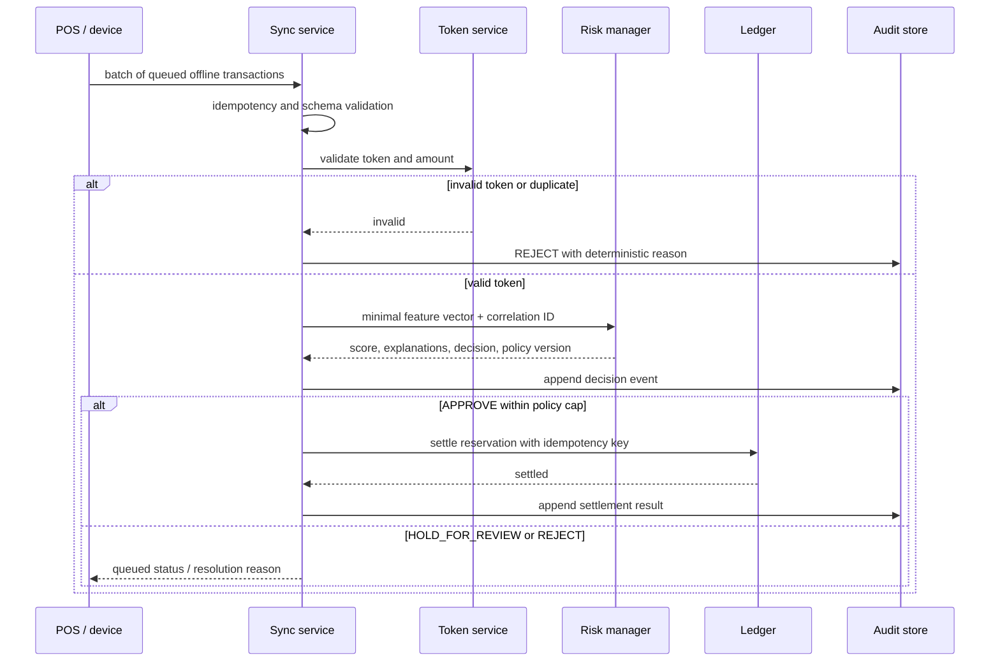

# Paron Guard: AI Risk Manager Architecture

**Buildathon track:** AI Risk Manager  
**One-line pitch:** Paron Guard protects merchants from losses in delayed and offline payment settlement by reserving customer funds, bounding offline exposure, scoring every synchronised transaction, and applying only auditable actions.

## 1. Why this is the right evolution

Paron already solves a difficult payments problem: a customer can spend a value-backed offline token and the transaction is settled once the device reconnects. The risk appears in the gap between offline acceptance and online settlement: duplicated submissions, compromised devices, unusual amounts, replayed tokens, and suspicious timing can turn delayed settlement into merchant loss.

The Buildathon version turns the existing rule-based `fraud-service` into a **defence-only AI risk manager**. It does not attempt to generate fraud, bypass controls, or autonomously move money. It decides whether a transaction can proceed through a tightly constrained settlement workflow and produces evidence a merchant or reviewer can inspect. Merchant exposure is bounded by customer reservations, token limits, merchant policy, and (where configured) a capped guarantee reserve.

## 2. Product boundary

### In scope

- Ingest offline payment transactions when a device reconnects.
- Validate the signed spending token and reservation before any risk decision.
- Combine deterministic controls with a calibrated ML risk score.
- Produce an explanation, a policy decision, and a tamper-evident audit event for every decision.
- Protect the merchant before offline acceptance with customer fund reservations, merchant-specific offline limits, and an optional capped guarantee reserve.
- Allow only `APPROVE`, `HOLD_FOR_REVIEW`, or `REJECT` outcomes; settlement is permitted only after the required gate is satisfied.
- Create a dispute/compensation case when confirmed fraud occurs after delivery; the AI does not falsely guarantee recovery.
- Evaluate the detector on a held-out, labelled synthetic dataset and report precision, recall, false-positive cost, and latency.

### Explicitly out of scope

- Real bank, NPCI, or production Razorpay credentials.
- Credit underwriting, customer profiling beyond transaction-risk features, or any offensive security capability.
- Autonomous refunds, customer messaging, or account suspension.
- Replacing a merchant’s compliance, dispute, or human-review process.

## 3. Target architecture

```mermaid
flowchart LR
    Device[Customer device / merchant POS\noffline transaction queue] --> Gateway[API Gateway\nauth, rate limit, correlation ID]
    Gateway --> Sync[Sync service\nvalidate batch and enqueue]
    Sync --> Kafka[(Kafka\noffline-transactions)]
    Kafka --> Orchestrator[Settlement orchestrator\nidempotency + token validation]
    Orchestrator --> Token[Token service\nverify signed token]
    Token --> Ledger[Ledger service\nreservation and settlement]
    Ledger --> Protection[Merchant protection\nlimits and guarantee reserve]
    Orchestrator --> Features[Feature builder\ntransaction + historical aggregates]
    Features --> Rules[Deterministic risk rules\nreplay, velocity, amount, time]
    Features --> Model[Risk model service\nversioned calibrated classifier]
    Rules --> Policy[Decision policy\nbounded thresholds and gates]
    Model --> Policy
    Policy -->|APPROVE| Ledger
    Policy -->|HOLD_FOR_REVIEW / REJECT| Case[Merchant review queue]
    Policy --> Audit[(Audit store\nappend-only decision events)]
    Case --> Audit
    Ledger --> Audit
    Protection --> Audit
    Audit --> Dashboard[Merchant risk dashboard\nmetrics, explanations, cases]
    Dataset[Labelled synthetic dataset] --> Evaluation[Offline evaluation pipeline]
    Evaluation --> Registry[Model registry\nmetrics + approval]
    Registry --> Model
```

The existing Java services remain the system of record for tokens, reservations, transactions, and alerts. The model service is deliberately separated: it receives a minimal feature vector and returns a bounded probability plus model metadata; it cannot call the ledger, token service, or gateway.

## 4. Components and responsibilities

| Component | Existing / new | Responsibility |
|---|---|---|
| API gateway | Existing | Authenticates requests, rate-limits ingress, propagates a correlation ID; never exposes settlement or fraud-check internals publicly. |
| Sync service | Existing, extended | Accepts a maximum batch of 100 queued transactions, persists receipt status, emits Kafka events, and returns `202 Accepted`. |
| Token service | Existing | Verifies token signature, expiry, reservation binding, amount limit, and one-time-use state. |
| Ledger service | Existing, extended | Reserves, releases, and settles funds. It is the only component that changes customer financial state. |
| Merchant protection policy | New | Calculates customer offline limit, merchant/category cap, guarantee reserve, and residual exposure before acceptance. |
| Risk feature builder | New | Builds versioned features such as amount deviation, per-device velocity, token reuse, token age, merchant context, and offline duration. Raw JWTs and PII are excluded. |
| Rules engine | Existing, retained | Applies deterministic hard controls. A replayed token, invalid signature, or impossible temporal sequence cannot be overridden by the model. |
| Model service | New | Loads an approved model version and returns a calibrated risk score, confidence, top feature contributions, and fallback status. |
| Decision policy | New | Converts rules + model output into an allowlisted decision and action ceiling. Policy thresholds are config/version controlled. |
| Review queue | Existing alerts, extended | Lets an authorised merchant reviewer resolve held cases with a reason; reviewers cannot alter the original decision record. |
| Audit store | New | Appends request hash, feature schema/version, rule hits, model/version/output, policy version, decision, actor, timestamps, and settlement result. |
| Evaluation pipeline | New | Creates train/validation/test splits by time/device, evaluates on the held-out test set, and approves a release only when quality and cost gates pass. |

## 5. Decision flow and money guardrails

The policy has a strict action hierarchy:

| Condition | Decision | Permitted action |
|---|---|---|
| Invalid token, duplicate transaction, hard rule hit | `REJECT` | Do not settle; preserve reason and audit event. |
| Score below approved threshold and no hard control | `APPROVE` | Settle at most the already-reserved amount, once. |
| Score in review band, low confidence, or feature-quality warning | `HOLD_FOR_REVIEW` | Create a case; no movement of money. |
| Score above reject threshold | `REJECT` | Do not settle; display a concise reason. |
| Model unavailable, timeout, unknown version, or malformed explanation | `HOLD_FOR_REVIEW` | Fail closed; keep the transaction recoverable for review/retry. |
| Confirmed fraud after merchant delivery | `REJECT` / `DISPUTE` | Freeze settlement, open a compensation case, apply eligible reserve, and record residual exposure. |

This is intentionally not an autonomous money agent. The model can recommend a risk decision, but token validation, the policy gate, idempotency key, and ledger reservation remain independent controls.

## 5. Merchant protection and residual risk

An offline payment is not accepted solely because a token is valid. Before issuing or accepting a token, the protection policy checks:

1. Customer balance covers the reserved token limit.
2. Merchant/category and device limits cap the maximum unsettled exposure.
3. The token is bound to its expiry, device, merchant (when enabled), and one-time-use rules.
4. An optional platform or merchant guarantee reserve covers only a configured, capped amount.
5. The POS refuses payments above the displayed limit.

If fraud is confirmed after goods or services were delivered, Paron freezes settlement, preserves evidence, and opens a dispute/compensation case. Eligible funds are released from the customer reservation or configured guarantee reserve. Any uncovered amount is recorded as residual exposure with an explicit risk owner; the AI score does not pretend to eliminate that risk.

Recommended demo defaults are a ₹5,000 customer token limit, ₹1,000 individual payment cap, six-hour expiry, and a configurable 10% guarantee reserve. These are demonstration parameters, not production financial advice.

## 6. AI design

### Feature contract

The initial model uses structured tabular features that can be reproduced from an audit event:

- `amount`, `amount_to_token_limit_ratio`, and merchant-relative amount deviation
- transactions and value in trailing 5-minute, 1-hour, and 24-hour windows per user/device/token
- token age, time remaining to expiry, and offline duration
- token reuse count, duplicate payload hash count, and previous settlement outcome
- merchant risk aggregate and hour/day pattern
- feature freshness and missingness indicators

No raw token, payment instrument number, address, contact, or free-text field enters the model feature store. Identifiers are pseudonymised before aggregation and retained only for the documented review/audit period.

### Model and explanation

Start with a transparent, reproducible baseline: regularised logistic regression or a small gradient-boosted tree classifier calibrated on validation data. Persist:

- model version, training-data snapshot ID, feature schema version, and threshold-policy version;
- calibrated probability and confidence/fallback flag;
- deterministic rule hits; and
- the top 3 feature contributions rendered as plain-language reason codes.

An LLM is optional and confined to summarising already-approved structured evidence for the reviewer. It never determines the score, invokes tools, accesses secrets, or decides settlement.

## 7. Data, security, and reliability

- **Transport and service auth:** TLS in deployment; authenticated gateway ingress; service-to-service identity; internal money endpoints isolated from the public gateway.
- **Least privilege:** model service has read-only access to a feature view and write access only to its decision output; it has no database credentials for ledger mutation.
- **Idempotency:** use `deviceTransactionId` plus an immutable payload hash and ledger idempotency key. Duplicate submissions return the prior outcome.
- **Audit integrity:** append events with a chained hash (`previousEventHash`, `eventHash`) and restrict updates to review annotations; retain correlation IDs across services.
- **Availability:** Kafka buffers reconnection bursts; retry only safe, idempotent operations; use circuit breakers for token/ledger/model calls.
- **Failure handling:** model timeout, stale feature, or unavailable dependency yields `HOLD_FOR_REVIEW`, not an approval. The event is replayable from Kafka/audit data.
- **Observability:** structured logs, OpenTelemetry traces, and dashboards for decision counts, model latency, fallback rate, queue age, false-positive review outcomes, and settlement success.

## 8. Delivery plan

| Phase | Deliverable | Proof in demo |
|---|---|---|
| 1. Baseline | Current rules, audited decisions, synthetic labelled generator | Replay a normal transaction and a duplicate/token-reuse rejection. |
| 2. AI risk layer | Feature builder, calibrated model, explanation contract, policy thresholds | Compare rules-only and hybrid metrics on an untouched held-out split. |
| 3. Safe operations | Review queue, fail-closed fallback, audit timeline, dashboard | Stop the model service and show `HOLD_FOR_REVIEW` with no ledger settlement. |
| 4. Submission polish | One-command demo, seeded 50+ transaction batch, 5-minute pitch, architecture and metric report | Show value, reliability, metrics, and limits honestly. |

## 9. Buildathon evidence checklist

- Public repository with setup instructions, synthetic data only, and an architecture diagram.
- Five-minute video: problem (30s), system walk-through (90s), batch demo (90s), metrics (60s), failure/audit trace (60s).
- Held-out test report: precision, recall, PR-AUC, confusion matrix, threshold, sample count, and false-positive rupee cost.
- One graceful failure demo: risk-model timeout results in a held case and no settlement.
- One audit trace from input through decision to settlement or review.
- Explicit limitations: synthetic labels are not production performance; human review and policy ownership remain necessary.
